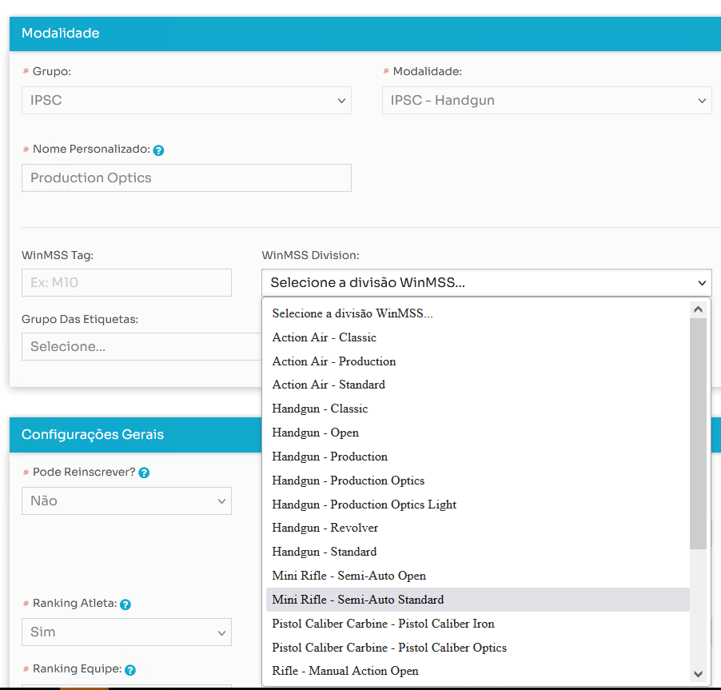

# Processo de Exportação / WinMSS s ShootinHouse

Este processo de exportação foi desenvolvido para ser utilizado através da interface web da aplicação. Ele é acionado ao clicar no botão **"Exportar para WinMSS"** disponível na página de exportação.

## Contexto
O objetivo principal deste recurso é permitir que os administradores e organizadores de competições possam gerar arquivos compatíveis com os sistemas **WinMSS** e **ShootingHouse** de maneira simplificada e eficiente. Estes arquivos contêm informações detalhadas da competição, como competidores, etapas (stages), resultados e muito mais.

## Processo de Exportação

1. **Ao clicar no botão de exportação**, o sistema processa automaticamente os dados da competição e gera os arquivos necessários nos formatos exigidos pelos sistemas de destino.

2. **Geração de Arquivos XML**: O sistema cria vários arquivos XML com as informações da competição, organizados por categorias e divisões.

3. **Arquivos .cab para WinMSS**: Após a criação dos XMLs, eles são compactados em um arquivo `.cab`.

4. **Arquivos .zip para ShootingHouse**: O sistema também gera um arquivo `.zip` contendo os XMLs, compatível com o ShootingHouse.

5. **Download**: Os arquivos gerados são disponibilizados para download diretamente na página após a conclusão do processo.

## Regras de Negócio

- **Associação de Atletas a Divisões**: Atletas inscritos em múltiplas divisões são tratados individualmente, com um registro separado para cada divisão.
  
- **Ajuste de Pontuações**: Resultados como "DNF" ou "DQ" são convertidos para valores neutros (como `0.00` ou `0`).

- **Geração de Tags Padrão**: Se uma divisão não tiver uma tag específica, uma **tag padrão** é adicionada ao XML.

- **Validação de Dados**: O sistema valida os dados antes da exportação para garantir que estejam no formato correto.

## Instruções para o Sistema ShootingHouse

Ao importar os arquivos gerados no sistema **ShootingHouse**, é necessário utilizar o **campo de identificação interna** do sistema para selecionar a importação. Este campo vincula automaticamente a modalidade importada com a modalidade do **WinMSS**, facilitando o processo de gestão de resultados e assegurando que os dados sejam corretamente associados no sistema.

## Funcionamento na Interface Web

A interação com o usuário é simples: ao clicar no botão **"Exportar para WinMSS"**, todo o processamento é feito em segundo plano, e o usuário pode baixar os arquivos gerados assim que estiverem prontos.

## Vinculação Correta de Modalidades no Arquivo zip para o ShootingHouse

- Configure no shootinghouse na parte de modalidades da prova, o vinculo com a divisão/modalidade conforme imagem abaixo:



Seguem as configurações de vinculo de divisão e categoria

```
    "Semi-Auto Open": "Mini Rifle",
    "Semi-Auto Standard": "Mini Rifle",
    "Pistol Caliber": "Pistol Caliber Carbine",
    "Pistol Caliber Optics": "Pistol Caliber Carbine",
    "Pistol Caliber Iron": "Pistol Caliber Carbine",
    "PCC Iron": "Pistol Caliber Carbine",
    "PCC Optics": "Pistol Caliber Carbine",
    "Production": "Handgun",
    "Light": "Handgun",
    "Standard": "Handgun",
    "Production Optics": "Handgun",
    "Open": "Handgun",
    "Classic": "Handgun",
    "Revólver": "Handgun",
    "Revolver": "Handgun",
    "380": "Handgun",
    "CCP Open": "Pistol Caliber Carbine",
    "CCP - Open": "Pistol Caliber Carbine",
    "CCP-Open": "Pistol Caliber Carbine",
    "Shotgun Open": "Shotgun",
    "Shotgun Standard": "Shotgun",
    "Standard Manual": "Shotgun",
    "Standard Modified": "Shotgun",
    "Pistol Caliber Iron": "Pistol Caliber Carbine",
    "Pistol Caliber Opctics": "Pistol Caliber Carbine",
    "Manual Action Open": "Rifle",
    "Manual Action Standard": "Rifle",
    "Fuzil Semi-Auto Open": "Rifle",
    "Rifle Semi-Auto Open": "Rifle",
    "Rifle Semi-Auto Standard": "Rifle",
    "Mini-rifle Open": "Mini Rifle",
    "Mini-rifle Standard": "Mini Rifle",

```

E confoguração de categoria - divisão vinculada ao winmss e o "firearm_id"

Modalidade - Divisão

```
    "Action Air - Classic": 23,
    "Action Air - Production": 22,
    "Action Air - Standard": 21,
    "Handgun - Classic": 18,
    "Handgun - Open": 1,
    "Handgun - Production": 4,
    "Handgun - Production Optics": 24,
    "Handgun - Production Optics Light": 28,
    "Handgun - Revolver": 5,
    "Handgun - Revólver": 5,
    "Handgun - Standard": 2,
    "Mini Rifle - Semi-Auto Open": 25,
    "Mini Rifle - Semi-Auto Standard": 26,
    "Pistol Caliber Carbine - Pistol Caliber Iron": 31,
    "Pistol Caliber Carbine - Pistol Caliber Optics": 29,
    "Rifle - Manual Action Open": 7,
    "Rifle - Manual Action Standard": 9,
    "Rifle - Semi-Auto Open": 6,
    "Rifle - Semi-Auto Standard": 8,
    "Shotgun - Open": 10,
    "Shotgun - Standard": 11,
    "Shotgun - Standard Manual": 12,
    "Shotgun - Standard Modified": 13,

```
Vinculo do firearm_id no arquivo gerado para o winMSS

Onde

```
    #FirearmId='7' = CCP
    #FirearmId='6' = Mini Rifle
    #FirearmId='2' = Rifle
    #FirearmId='3' = Shotgun
    #FirearmId='1' = Handgun
```
Ficando a configuração de exportação conforme abaixo

```
    "Action Air - Classic": 1,
    "Action Air - Production": 1,
    "Action Air - Standard": 1,
    "Handgun - Classic": 1,
    "Handgun - Open": 1,
    "Handgun - Production": 1,
    "Handgun - Production Optics": 1,
    "Handgun - Production Optics Light": 1,
    "Handgun - Revolver": 1,
    "Handgun - Revólver": 1,
    "Handgun - Standard": 1,
    "Mini Rifle - Semi-Auto Open": 6,
    "Mini Rifle - Semi-Auto Standard": 6,
    "Pistol Caliber Carbine - Pistol Caliber Iron": 7,
    "Pistol Caliber Carbine - Pistol Caliber Optics": 7,
    "Rifle - Manual Action Open": 2,
    "Rifle - Manual Action Standard": 2,
    "Rifle - Semi-Auto Open": 2,
    "Rifle - Semi-Auto Standard": 2,
    "Shotgun - Open": 3,
    "Shotgun - Standard": 3,
    "Shotgun - Standard Manual": 3,
    "Shotgun - Standard Modified": 3,
```

- Categorias que estiverem com unknown vão ficar como padrão **Handgun - Open**


## Tags Especiais

- Para a **divisão Light** e/ou **380**, será gerada automaticamente a **tag "380"** nos arquivos XML para garantir que a divisão seja importada corretamente.


- Para a **Semi Auto Open**, geralmente vinculada a Mini Rifle será gerada automaticamente a **tag "MRO"** nos arquivos XML para garantir que a divisão seja importada corretamente.

- Demais divisões, não vão ter tag vinculada. Divisões que estão com o nome de "Unknown - *Divisão*" vão estar sempre vinculadas a **Handgun - Open**

- Outras modalidades que não possuem tags específicas seguirão as regras padrão de vinculação e geração de tags definidas pelo sistema.

