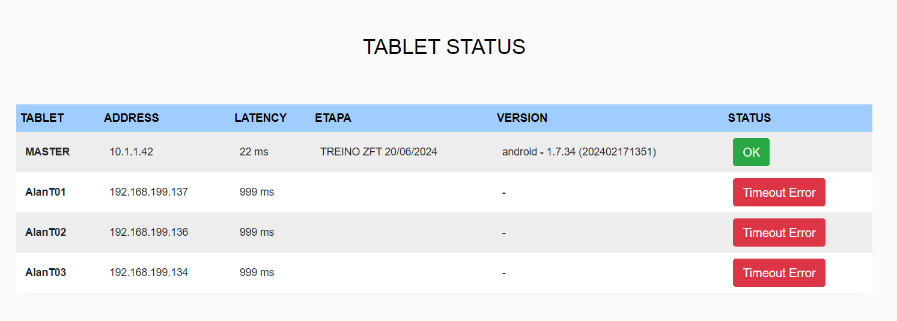
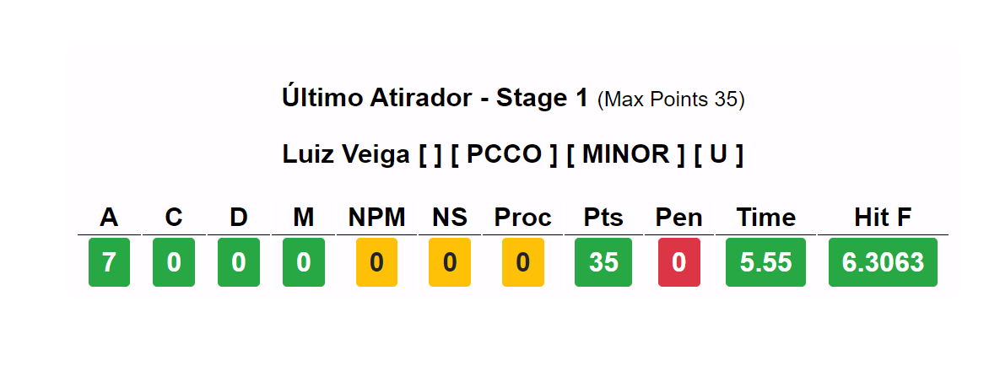
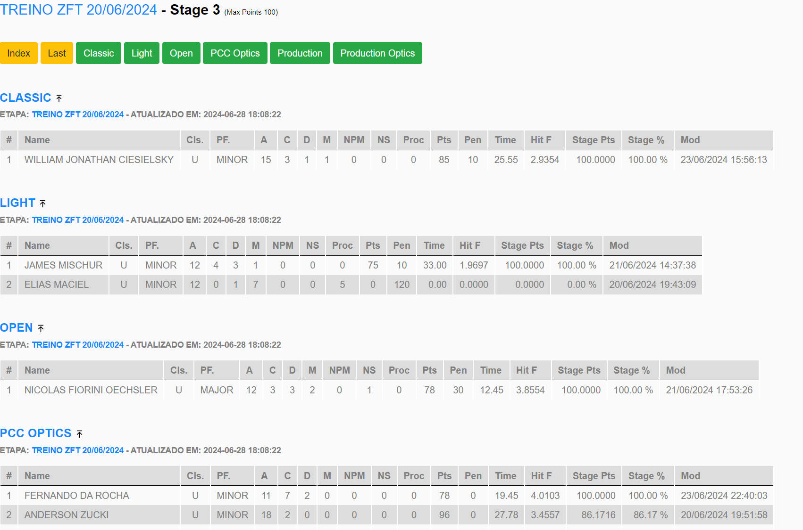
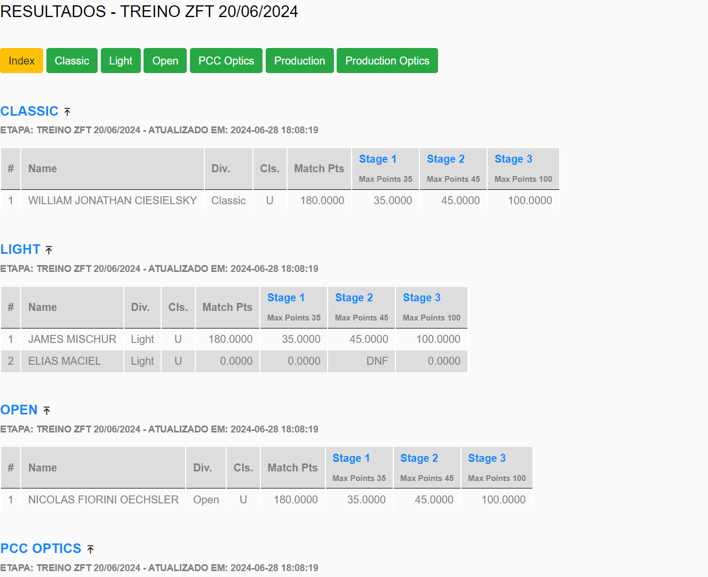
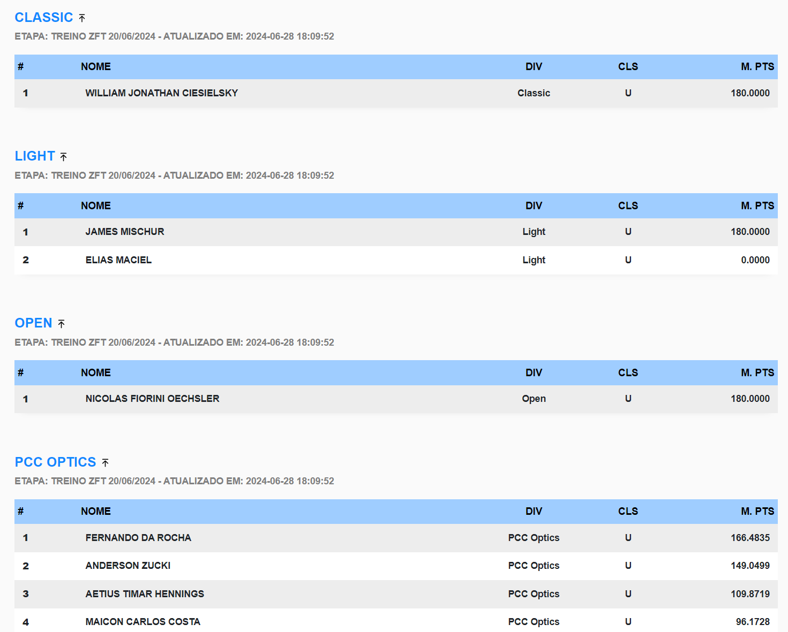
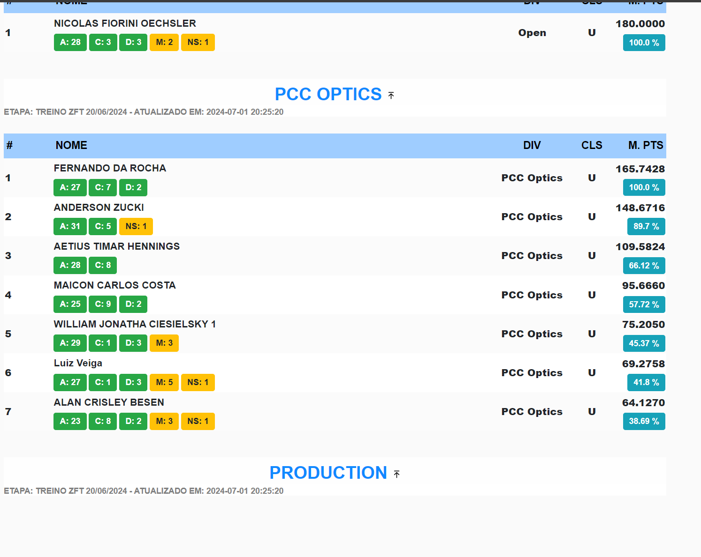
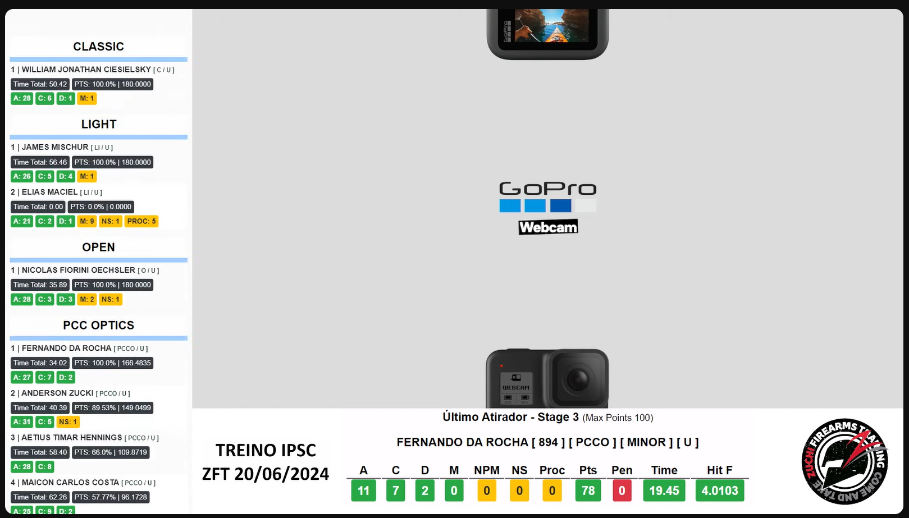

# Sobre

Solução de integração com Aplicativo PractiScore (1.7.x e 2.0.x) para Leaderboard em tempo real e transmissão Online. 

Aplicação: Provas de IPSC para clubes e federações que desejam ter provas mais imersivas e interativas com os atletas. 

Pontos Chaves: IPSC, Practiscore, Leaderboards, score logs, live stream, live results, live score, kiosk mode for practiscore

#### CONTATOS:

* [Instagram](https://www.instagram.com/alanbesen_ipsc)

* [YouTube](https://www.youtube.com/@alanbesen_ipsc)

* [Email](mailto:alanc.besen@gmail.com)

* [GitHub](https://github.com/alanbesen)

#### EQUIPE IPSC - ZFT INDAIAL/LSC:

* [Instagram](https://www.instagram.com/zuchifirearmstraining/)

## Principais funcionalidades

* Modo Quiosque para exibição em TV 
* Modo de exibição com Overlay para OBS Studio
* Modo de exibição por stage (com a pontuação do último atleta)
* Lista de Dispositivos (tablets) com status de latência da rede
* Resultados por stage e por divisão em tempo real
* Resultados por match points em tempo real
* Resultados agrupados com somatórias em tempo real
* Multi Tablets - Coleta resultados de vários tablets de forma sincronizada

## Exemplo - Live com OBS Studio



# Screenshots

## Tablet list

Informações dos tablets, para acompanhar a sincronia de dados 

## Último atirador do Stage

Caso de uso: Dispositivo ou tablet em cada stage, onde exibe o restultado do último atirador que pontuou na pista

## Stage Detalhado

## Stage Resumo

## Modo TV - Quiosque

Deixar uma ou mais TVs ou dispositivos em loop para exibição dos resultados

## Modo TV - Quiosque - Com Soma dos Totais

Deixar uma ou mais TVs ou dispositivos em loop para exibição dos resultados, onde soma todos os pontos (A, C, D, M e etc) dos stages que o atirador já passou. 

## Modo Stream - Com overlay para OBS studio

Transmissão online com uma ou mais cameras fixas, com possibilidade de vários cenários e transições, overlay de exemplo no print screen abaixo com o resultado dos atletas, onde soma todos os pontos (A, C, D, M e etc) dos stages que o atirador já passou, atualizando em tempo real caso o atleta passe em outros stages

#
© 2024 Alan Besen. Todos os direitos reservados.

