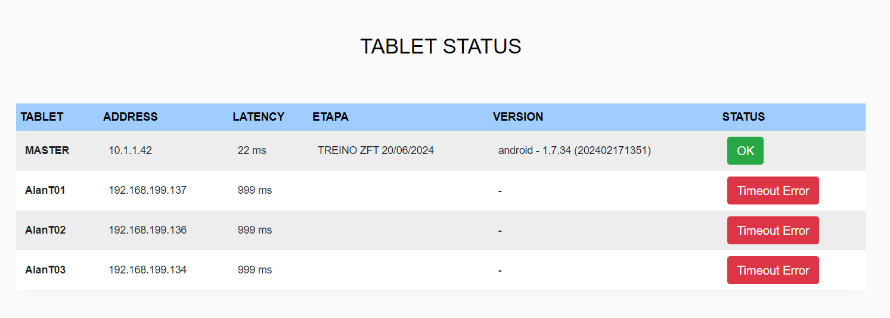
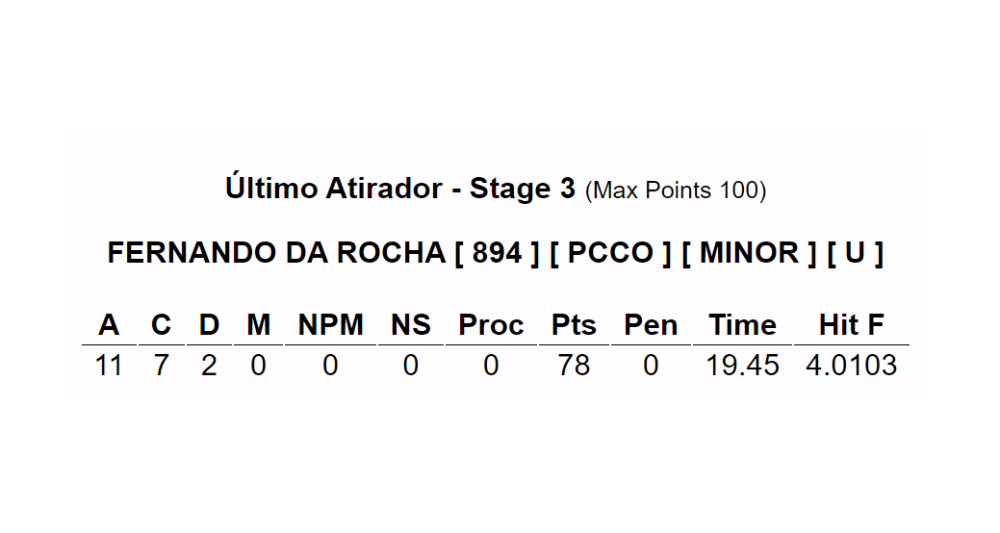
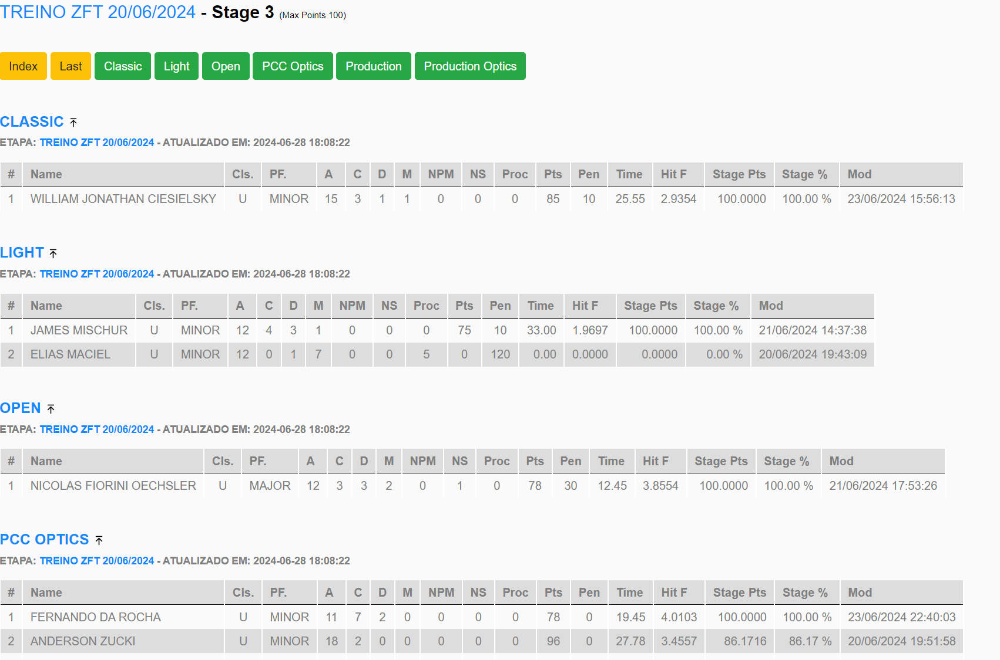
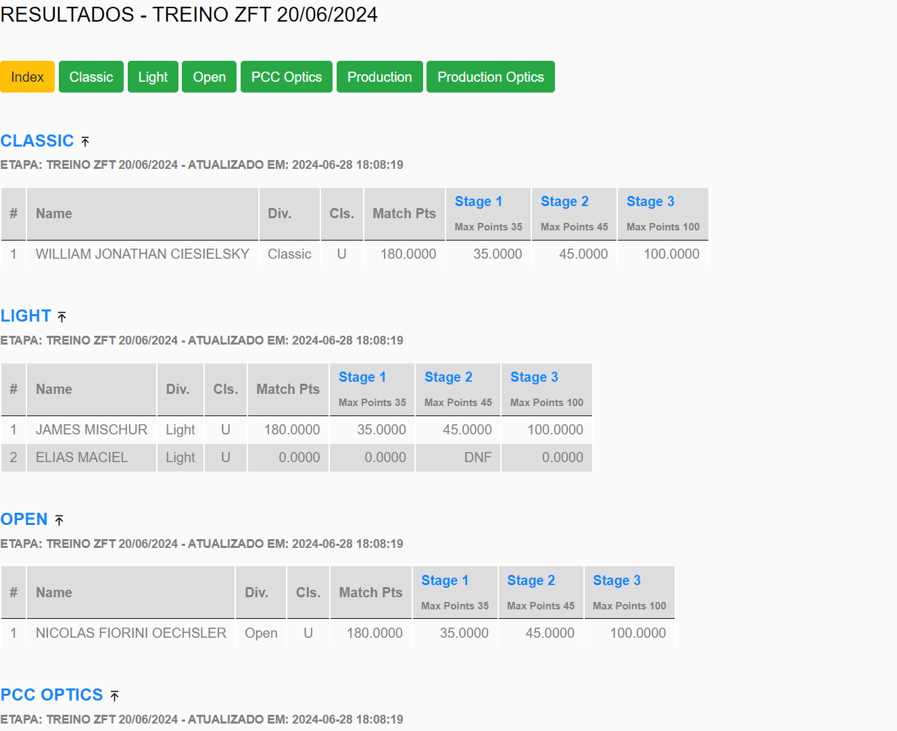
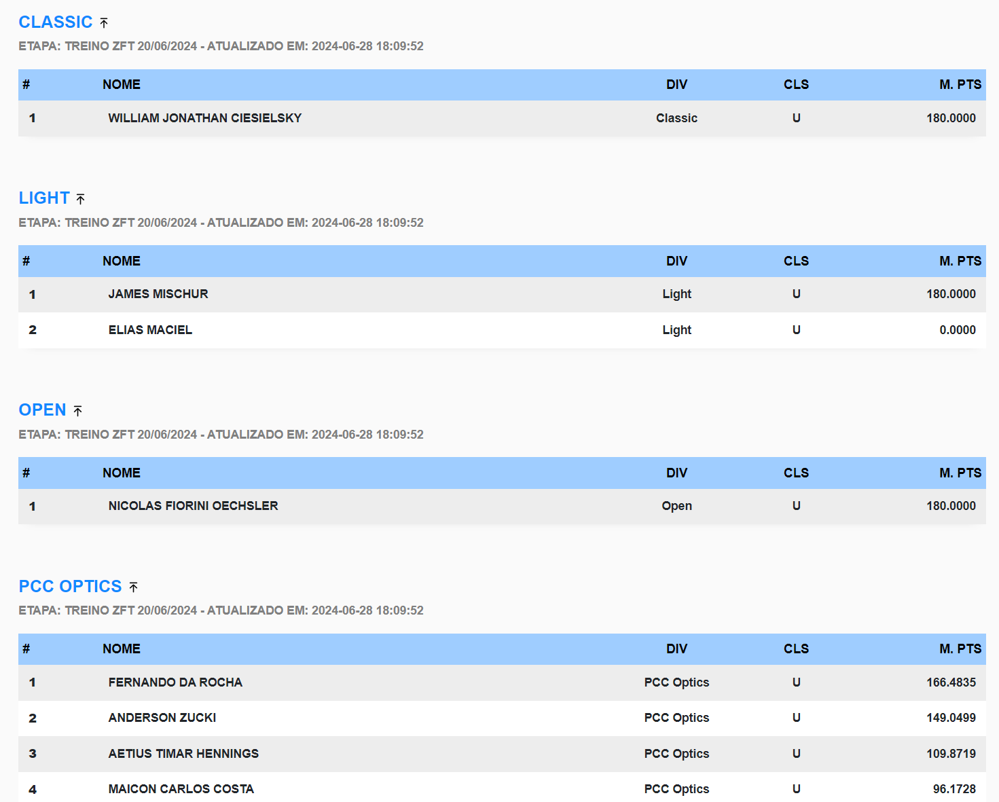

## PractiScore Leader Board

Solução de integração com Aplicativo PractiScore (1.7.x e 2.0.x) para Leaderboard em tempo real e transmissão Online. 

## Principais funcionalidades

* Modo Quiosque para exibição em TV 
* Modo de exibição com Overlay para OBS Studio
* Modo de exibição por stage (com a pontuação do último atleta)
* Lista de Dispositivos (tablets) e status em tempo real
* Resultados por stage e por divisão em tempo real
* Resultados por match points em tempo real

## Exemplo - Live com OBS Studio



## Screenshots

### Tablet list

### Último atirar do Stage

### Stage Detalhado

### Stage Resumo

### Modo TV - Quiosque

