# IPSC Leaderboard para PractiScore

## Visão Geral

Nossa solução oferece uma integração avançada com o aplicativo PractiScore (versões 1.7.x e 2.0.x), proporcionando uma experiência de Leaderboard em tempo real e transmissão online de alta qualidade. Projetada especificamente para competições de IPSC, essa solução é ideal para clubes e federações que buscam elevar o nível de interatividade e imersão durante suas provas.

### Para Quem é Esta Solução?

Essa solução é voltada para clubes e federações de IPSC que desejam proporcionar uma experiência diferenciada em suas provas, conectando atletas e público de maneira inovadora. Com funcionalidades como Leaderboards interativos, score logs detalhados, resultados ao vivo e modos de exibição em quiosque, a aplicação torna o gerenciamento e a visualização dos dados de prova mais eficientes e atraentes.

## Índice
{:.no_toc}

* Índice
{:toc}

## Características Principais

### Pontos-Chave

- **IPSC**: Foco total em competições de IPSC, atendendo às necessidades específicas desse esporte
- **PractiScore**: Integração completa com as versões 1.7.x e 2.0.x do aplicativo
- **Leaderboards em Tempo Real**: Atualização instantânea dos placares
- **Score Logs**: Registro detalhado das pontuações
- **Live Stream**: Transmissão ao vivo com integração de resultados
- **Resultados Ao Vivo**: Visualização instantânea dos resultados
- **Modo Quiosque**: Exibição contínua dos resultados em telas dedicadas

### Funcionalidades Detalhadas

#### Exibição e Visualização
- **Modo Quiosque para TV**: Exibição contínua e em loop dos resultados
- **Overlay para OBS Studio**: Integração com transmissões ao vivo
- **Exibição por Stage**: Resultados detalhados com pontuação do último atleta
- **Multi-Visualização**: Diferentes modos de exibição para diferentes necessidades

#### Gestão e Monitoramento
- **Lista de Dispositivos**: Monitoramento de tablets com status de latência
- **Resultados em Tempo Real**: Por stage, divisão e match points
- **Somatórias Automáticas**: Cálculos e agregações em tempo real
- **Multi Tablets**: Coleta sincronizada de resultados

## Demonstração e Exemplos

### Live Stream com OBS Studio

Veja como nossa solução se integra com o OBS Studio para transmissões profissionais:



## Interface e Visualizações

### Monitoramento de Dispositivos
[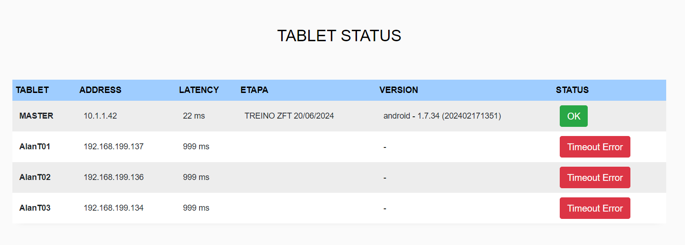](docs/assets/tablet01.png)
*Lista de tablets com status de conexão e sincronização*

### Visualização de Stages
[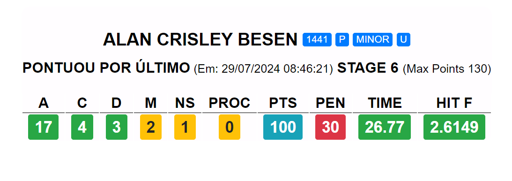](docs/assets/stage_last03.png)
*Último atirador do stage com resultados detalhados*

[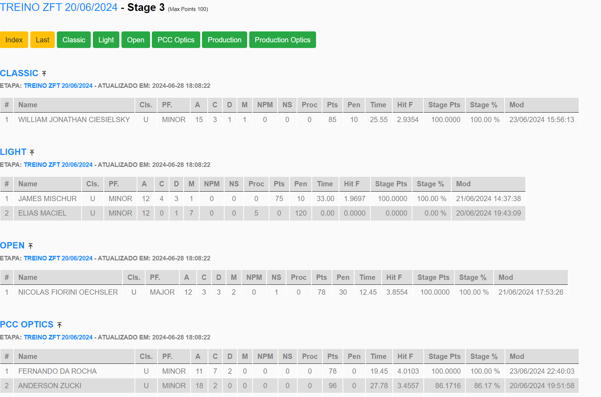](docs/assets/stage01.png)
*Visão detalhada do stage com todas as informações*

[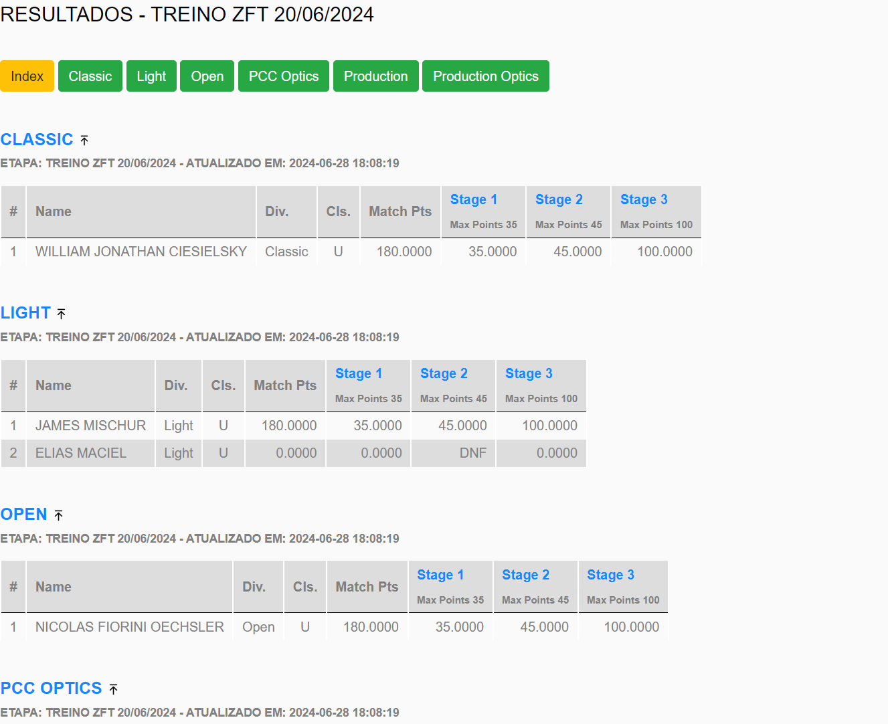](docs/assets/stage02.png)
*Resumo consolidado do stage*

### Modos de Exibição
[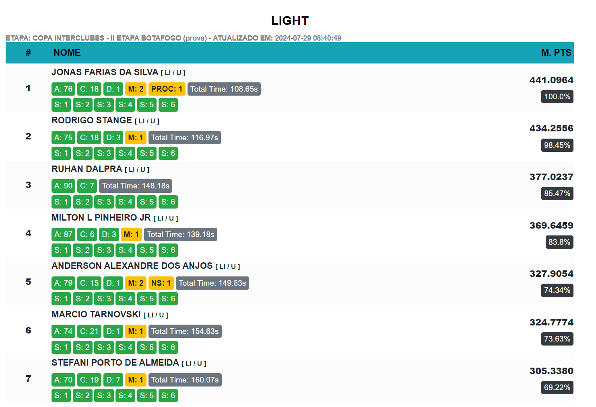](docs/assets/kiosk05.png)
*Modo TV com somatória de totais*

[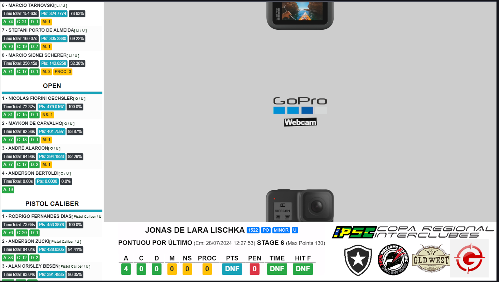](docs/assets/youtube03.png)
*Overlay para transmissões ao vivo*

## Integração com IPSC.guru

### Resultados Online em Tempo Real
[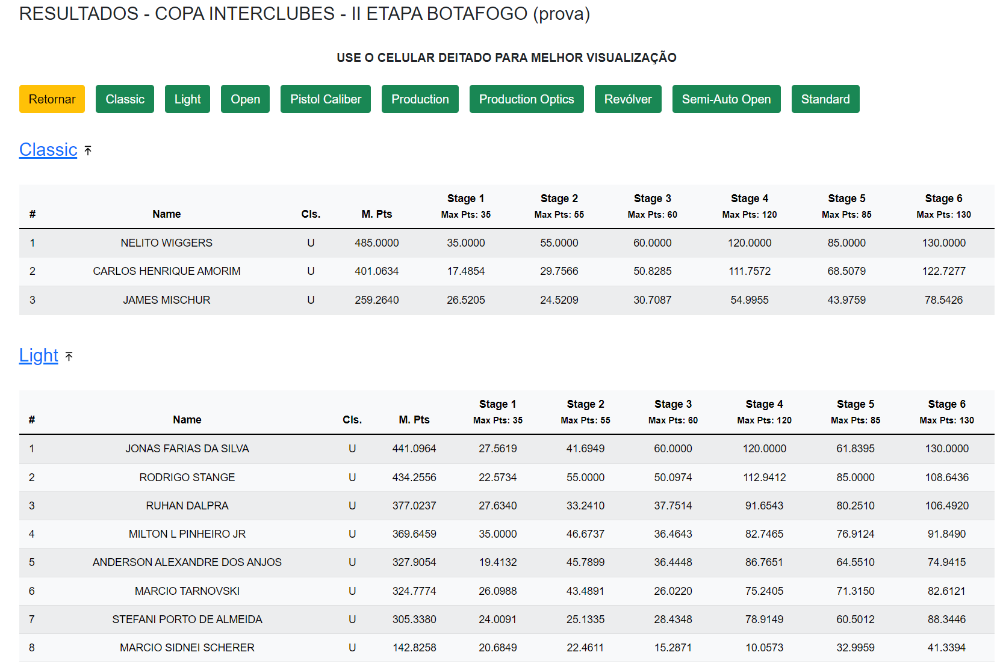](docs/assets/online01.png)
*Visualização online dos resultados via IPSC.guru*

[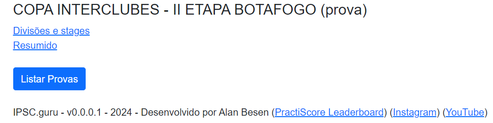](docs/assets/online02.png)
*Dashboard de resultados em tempo real*

### Gestão de Provas
[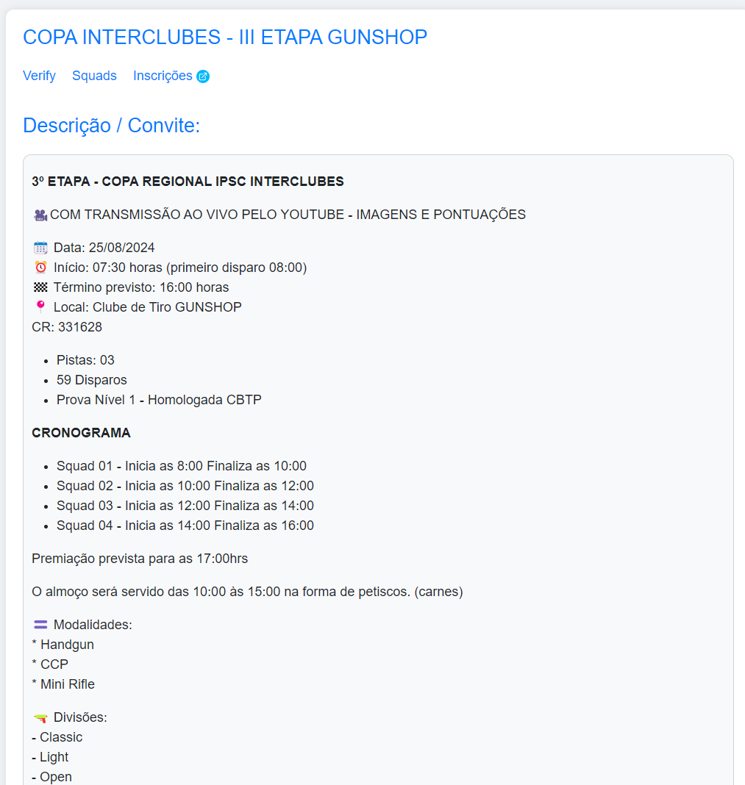](docs/assets/Verify0001.png)
*Interface de verificação online*

[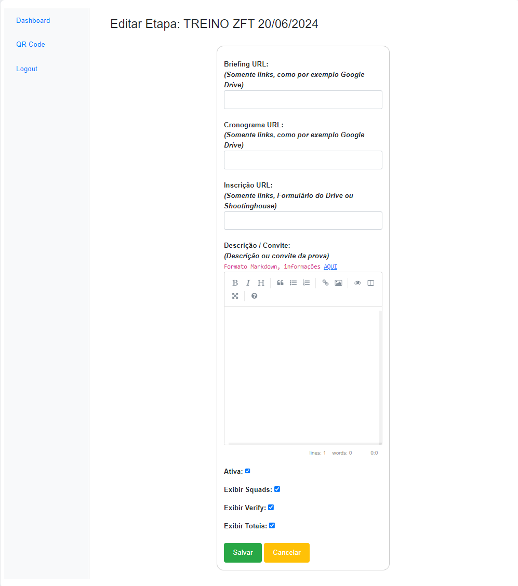](docs/assets/match_admin.png)
*Painel de administração da prova*

[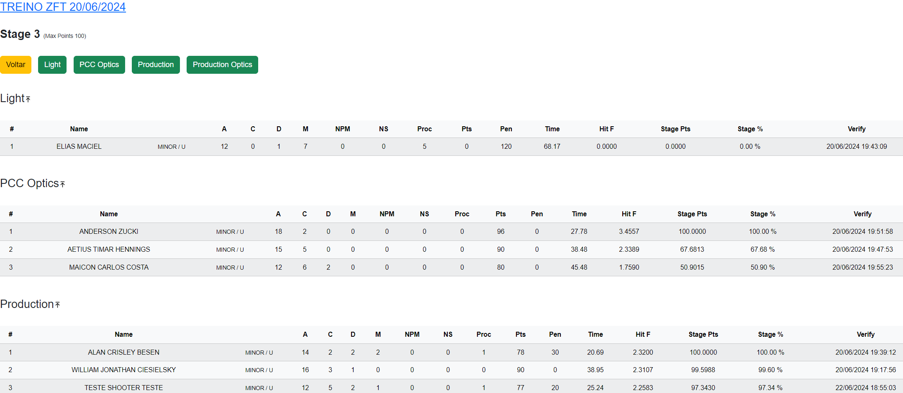](docs/assets/verify0002.png)
*Verificação detalhada por atleta*

## Exportação e Compatibilidade

### Export para WinMSS e Shootinghouse
[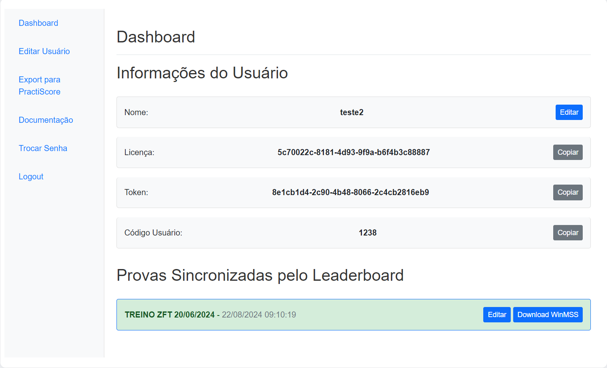](docs/assets/winmss_export_ps2.png)
*Interface de exportação para WinMSS*

[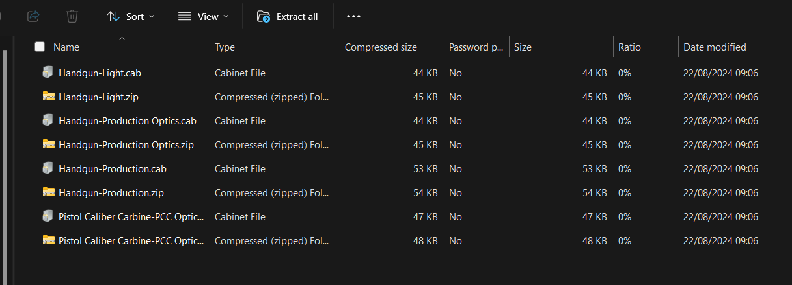](docs/assets/export_winmss.png)
*Arquivos gerados prontos para importação*

## Contatos

- [Instagram](https://www.instagram.com/alanbesen.ipsc/)
- [YouTube](https://www.youtube.com/@alanbesen_ipsc)
- [Email](mailto:alanc.besen@gmail.com)
- [GitHub](https://github.com/alanbesen)

### Equipe IPSC - ZFT Indaial/LSC
- [Instagram](https://www.instagram.com/zuchifirearmstraining/)

---

© 2024 Alan Besen. Todos os direitos reservados.

