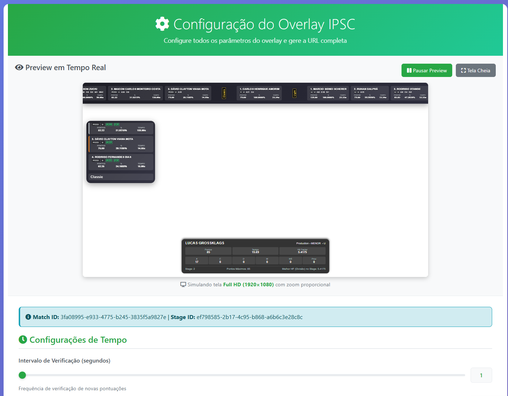
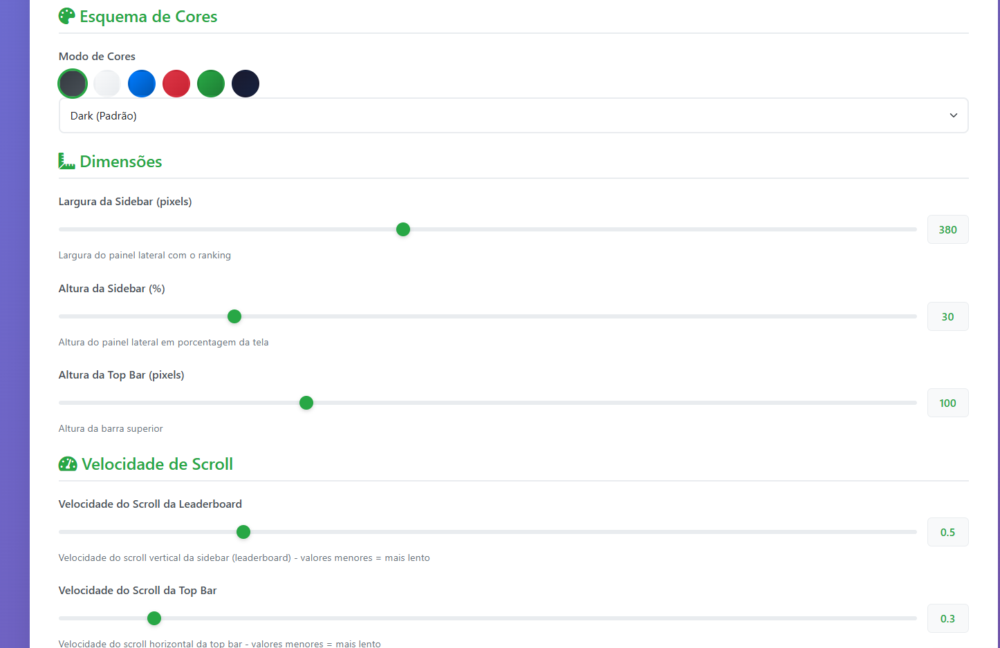

# IPSC Leaderboard para PractiScore

## Transforme Suas Competições IPSC em Experiências Memoráveis

**A solução definitiva para clubes e federações que querem levar suas competições IPSC ao próximo nível.** Integração perfeita com PractiScore, leaderboards em tempo real e transmissões profissionais que mantêm atletas e público conectados a cada momento da prova.

### 🎯 Por Que Escolher Nossa Solução?

**Imagine suas competições com:**
- ✅ **Leaderboards em tempo real** que atualizam instantaneamente
- ✅ **Transmissões profissionais** com overlays customizados
- ✅ **Experiência imersiva** para atletas e espectadores
- ✅ **Integração perfeita** com PractiScore 1.7.x e 2.0.x
- ✅ **Modo quiosque** para exibição contínua em TVs
- ✅ **Score logs detalhados** para análise completa

## Índice
{:.no_toc}

* Índice
{:toc}

## 🚀 Características Revolucionárias

### Tecnologia de Ponta para IPSC

**Desenvolvida especificamente para competições IPSC**, nossa solução oferece:

#### ⚡ Performance em Tempo Real
- **Atualização instantânea** dos placares
- **Sincronização perfeita** entre tablets e painel
- **Latência mínima** para resultados imediatos
- **Multi-tablets** com coleta sincronizada

#### 📊 Visualizações Profissionais
- **Modo Quiosque para TV**: Exibição contínua e em loop
- **Overlay para OBS Studio**: Integração com transmissões ao vivo
- **Exibição por Stage**: Resultados detalhados com pontuação do último atleta
- **Multi-Visualização**: Diferentes modos para diferentes necessidades

#### 🎬 Transmissões de Alto Impacto
- **Overlays customizados** para OBS Studio
- **Integração com Prism** (app Android/iPhone)
- **Transmissões profissionais** com dados em tempo real
- **Experiência cinematográfica** para espectadores

## 🎥 Veja em Ação

### Live Stream Profissional

**Transforme suas transmissões em experiências cinematográficas:**



*Veja como nossa solução se integra perfeitamente com OBS Studio, Prism e similares para criar transmissões profissionais com overlays customizados.*

## 📱 Interface Intuitiva e Poderosa

### Monitoramento Inteligente de Dispositivos

*Controle total sobre seus tablets com status de conexão e sincronização em tempo real*

### Visualizações Detalhadas por Stage

*Último atirador do stage com resultados detalhados e análise completa*

*Visão detalhada do stage com todas as informações essenciais*

*Resumo consolidado do stage para tomada de decisões rápidas*

### Modos de Exibição Versáteis

*Modo TV com somatória de totais - perfeito para exibição em telas grandes*

*Overlays customizados para transmissões ao vivo - profissionalismo garantido*

## 🌐 Integração Completa com Scoring.Services

### Resultados Online em Tempo Real

*Acesso online aos resultados via Scoring.Services - conectividade total*

*Dashboard de resultados em tempo real - controle absoluto*

### Gestão Profissional de Provas

*Interface de verificação online - precisão garantida*

*Painel de administração da prova - controle total*

*Verificação detalhada por atleta - transparência completa*

## 🔄 Exportação e Compatibilidade Total

### Export para WinMSS e Shootinghouse

*Interface de exportação para WinMSS - compatibilidade total*

*Arquivos gerados prontos para importação - facilidade máxima*

## 💡 Benefícios Exclusivos

### Para Clubes e Federações
- **Diferencial competitivo** - destaque-se da concorrência
- **Experiência premium** para atletas e espectadores
- **Profissionalismo** em todas as transmissões
- **Facilidade de gestão** com interface intuitiva
- **Compatibilidade total** com sistemas existentes

### Para Atletas
- **Resultados em tempo real** - acompanhe sua performance instantaneamente
- **Experiência imersiva** - sinta-se parte de algo maior
- **Transparência total** - todos os dados disponíveis
- **Conectividade** - compartilhe sua jornada facilmente

### Para Espectadores
- **Transmissões profissionais** com dados integrados
- **Experiência cinematográfica** em tempo real
- **Engajamento total** com a competição
- **Acesso multiplataforma** aos resultados

## 🎯 Casos de Uso Ideais

### Competições Regionais
- **Leaderboards em tempo real** para acompanhamento local
- **Transmissões ao vivo** para espectadores remotos
- **Modo quiosque** para exibição no local

### Campeonatos Nacionais
- **Multi-tablets** para coleta simultânea
- **Overlays profissionais** para transmissões nacionais
- **Exportação automática** para federações

### Eventos Internacionais
- **Integração completa** com sistemas globais
- **Transmissões de alta qualidade** para audiência internacional
- **Compatibilidade total** com padrões IPSC

## 📞 Entre em Contato

**Pronto para transformar suas competições IPSC?**

### Redes Sociais
- [Instagram](https://www.instagram.com/scoring.services/) - Acompanhe nossos projetos
- [YouTube](https://www.youtube.com/@alanbesen_ipsc) - Veja demos e tutoriais
- [GitHub](https://github.com/scoring.services) - Acesse nosso código

### Contato Direto
- [Email](mailto:alanc.besen@gmail.com) - Solicite uma demonstração
- [Scoring Services](https://scoring.services) - Visite nosso site principal

### Parceiros
**Equipe IPSC - ZFT Indaial/LSC**
- [Instagram](https://www.instagram.com/zuchifirearmstraining/) - Conheça nossos parceiros

---

**Transforme suas competições IPSC em experiências inesquecíveis. Entre em contato hoje mesmo e descubra como podemos elevar suas provas ao próximo nível.**

© 2025 Alan Besen / Scoring Services. Todos os direitos reservados.

