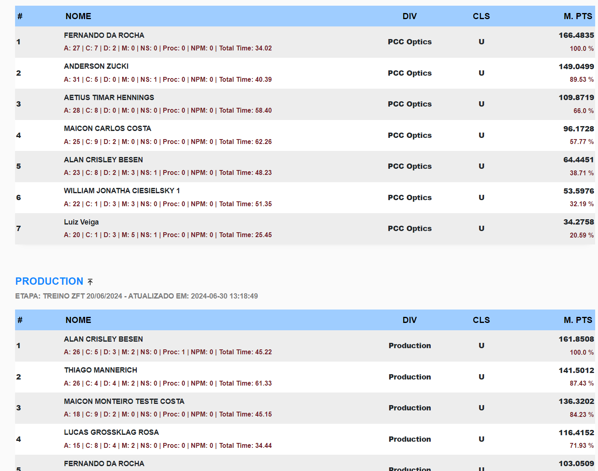

## PractiScore Leader Board

Solução de integração com Aplicativo PractiScore (1.7.x e 2.0.x) para Leaderboard em tempo real e transmissão Online. 

Aplicação: Provas de IPSC para clubes e federações que desejam ter provas mais imersivas e interativas com os atletas. 

Pontos Chaves: IPSC, Practiscore, Leaderboards, score logs, live stream, live results

## Principais funcionalidades

* Modo Quiosque para exibição em TV 
* Modo de exibição com Overlay para OBS Studio
* Modo de exibição por stage (com a pontuação do último atleta)
* Lista de Dispositivos (tablets) e status em tempo real
* Resultados por stage e por divisão em tempo real
* Resultados por match points em tempo real
* Resultados agrupados com somatórias em tempo real
* Multi Tablets - Coleta resultados de vários tablets

## Exemplo - Live com OBS Studio



## Screenshots

### Tablet list

### Último atirar do Stage

### Stage Detalhado

### Stage Resumo

### Modo TV - Quiosque

### Modo TV - Quiosque - Com Soma dos Totais

