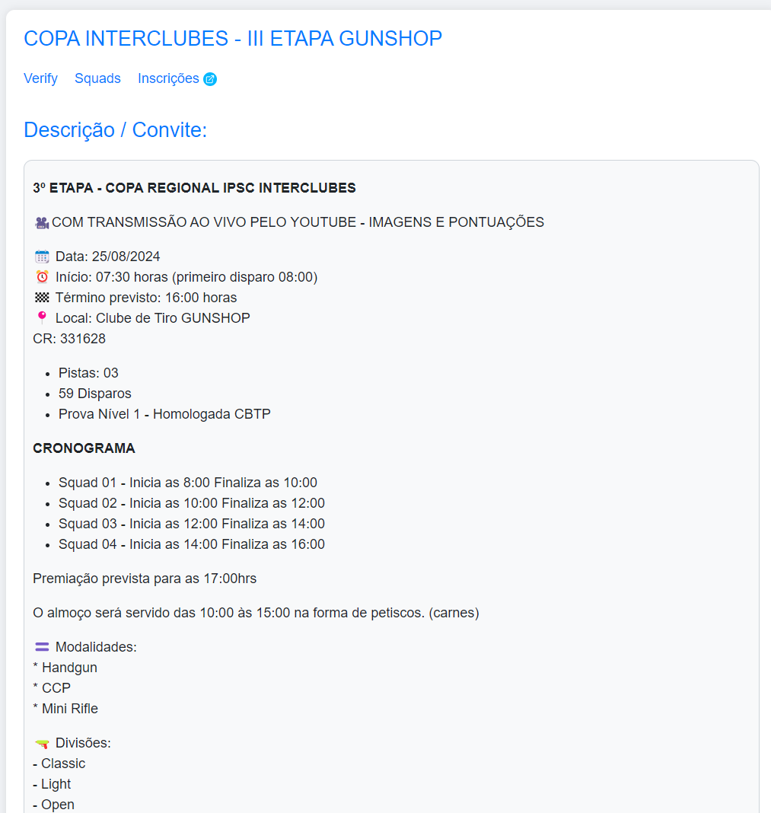

Solução de Integração com Aplicativo PractiScore (1.7.x e 2.0.x) para Leaderboard em Tempo Real e Transmissão Online

Nossa solução oferece uma integração avançada com o aplicativo PractiScore (versões 1.7.x e 2.0.x), proporcionando uma experiência de Leaderboard em tempo real e transmissão online de alta qualidade. Projetada especificamente para competições de IPSC, essa solução é ideal para clubes e federações que buscam elevar o nível de interatividade e imersão durante suas provas.

Com a nossa plataforma, os organizadores podem transformar suas competições em eventos dinâmicos e envolventes, onde os resultados são atualizados instantaneamente, e os espectadores podem acompanhar cada detalhe ao vivo, seja no local da prova ou remotamente via streaming. Além disso, a integração com o PractiScore permite uma sincronização perfeita dos dados, garantindo que todos os atletas, treinadores e fãs tenham acesso às informações mais recentes e precisas.

### Aplicação

Essa solução é voltada para clubes e federações de IPSC que desejam proporcionar uma experiência diferenciada em suas provas, conectando atletas e público de maneira inovadora. Com funcionalidades como Leaderboards interativos, score logs detalhados, resultados ao vivo e modos de exibição em quiosque, a aplicação torna o gerenciamento e a visualização dos dados de prova mais eficientes e atraentes.

### Pontos-Chave

- **IPSC**: Foco total em competições de IPSC, atendendo às necessidades específicas desse esporte.
- **PractiScore**: Integração completa com as versões 1.7.x e 2.0.x do aplicativo, facilitando a coleta e exibição dos resultados.
- **Leaderboards em Tempo Real**: Atualização instantânea dos placares, permitindo que todos acompanhem o desempenho dos atletas à medida que a competição avança.
- **Score Logs**: Registro detalhado das pontuações, disponível para análise imediata e futura.
- **Live Stream**: Transmissão ao vivo com integração de resultados em tempo real, proporcionando uma experiência imersiva para espectadores online.
- **Resultados Ao Vivo**: Visualização instantânea dos resultados conforme os atletas completam seus stages.
- **Modo Quiosque para PractiScore**: Exibição contínua dos resultados em telas dedicadas, ideal para áreas comuns do evento.

Essa integração não apenas melhora a organização e a comunicação durante as provas, mas também eleva o nível de engajamento dos participantes, tornando cada evento uma experiência única e memorável.

#### CONTATOS:

* [Instagram](https://www.instagram.com/alanbesen.ipsc/)

* [YouTube](https://www.youtube.com/@alanbesen_ipsc)

* [Email](mailto:alanc.besen@gmail.com)

* [GitHub](https://github.com/alanbesen)

#### EQUIPE IPSC - ZFT INDAIAL/LSC:

* [Instagram](https://www.instagram.com/zuchifirearmstraining/)

## Principais Funcionalidades

Nosso sistema oferece uma gama abrangente de funcionalidades projetadas para otimizar a exibição e gestão de resultados em tempo real durante as competições. Cada recurso foi cuidadosamente desenvolvido para atender às necessidades de atletas, organizadores e espectadores, garantindo uma experiência fluida e informativa.

* **Modo Quiosque para Exibição em TV**: Transforme qualquer TV em uma central de informações com o Modo Quiosque. Este modo permite a exibição contínua e em loop dos resultados de forma organizada, ideal para manter todos atualizados em áreas comuns do evento, como lounges ou zonas de espectadores.

* **Modo de Exibição com Overlay para OBS Studio**: Integração perfeita com OBS Studio, permitindo sobrepor os resultados em transmissões ao vivo. Esse recurso é essencial para eventos que desejam oferecer uma transmissão profissional, com informações atualizadas em tempo real diretamente na tela, mantendo o público engajado.

* **Modo de Exibição por Stage (com a Pontuação do Último Atleta)**: Exibição detalhada dos resultados de cada stage, destacando a pontuação do último atleta que completou o percurso. Este modo é ideal para monitores localizados nas pistas, permitindo que todos acompanhem o desempenho mais recente de cada competidor.

* **Lista de Dispositivos (Tablets) com Status de Latência da Rede**: Monitore a performance dos dispositivos em uso durante a prova. A lista de tablets fornece informações cruciais sobre a latência da rede, garantindo que todos os dispositivos estejam sincronizados e funcionando corretamente, evitando qualquer atraso na coleta de dados.

* **Resultados por Stage e por Divisão em Tempo Real**: Acompanhe os resultados em tempo real, divididos por stages e categorias. Essa funcionalidade permite uma análise precisa do desempenho de cada atleta em suas respectivas divisões, facilitando comparações e ajustes durante o evento.

* **Resultados por Match Points em Tempo Real**: Além dos resultados por stage, o sistema calcula e exibe os match points em tempo real, oferecendo uma visão geral do desempenho dos atletas ao longo de toda a competição. Essa métrica é crucial para entender a evolução do evento e prever resultados.

* **Resultados Agrupados com Somatórias em Tempo Real**: Obtenha uma visão agregada dos resultados com somatórias automáticas, que consideram todos os pontos conquistados pelos atletas até o momento. Essa funcionalidade é especialmente útil para organizadores que precisam de dados consolidados rapidamente.

* **Multi Tablets - Coleta de Resultados Sincronizada**: Nosso sistema suporta a coleta de resultados de vários tablets simultaneamente, mantendo todos os dados perfeitamente sincronizados. Isso garante que, independentemente do dispositivo utilizado, os resultados sejam precisos e atualizados em tempo real.

## Exemplo - Live com OBS Studio

Abaixo, apresentamos um exemplo de como a integração com OBS Studio pode ser utilizada para criar transmissões ao vivo profissionais, utilizando nosso sistema para sobrepor resultados e informações diretamente na tela.



# Screenshots

A seguir, algumas capturas de tela que exemplificam as funcionalidades em ação:

## Lista de Tablets

A lista de tablets oferece uma visão completa dos dispositivos em uso, permitindo monitorar a sincronia de dados e o status da rede em tempo real. Este recurso é vital para garantir que a coleta de dados ocorra de maneira eficiente e sem interrupções.

## Último Atirador do Stage

Este recurso é particularmente útil para dispositivos ou tablets posicionados em cada stage, exibindo o resultado do último atirador que completou a pista. Isso permite que todos os presentes acompanhem os resultados mais recentes de forma prática e imediata.

## Stage Detalhado

A exibição detalhada por stage oferece todas as informações pertinentes sobre o desempenho dos atletas, facilitando a análise minuciosa dos resultados.

## Resumo do Stage

O resumo do stage consolida as informações principais em uma visão simplificada, permitindo uma rápida compreensão dos resultados.

## Modo TV - Quiosque - Com Soma dos Totais

O Modo TV é ideal para a exibição contínua dos resultados em uma ou mais TVs, com somas automáticas dos pontos (A, C, D, M, etc.) e stages que o atleta já completou. Essa funcionalidade é perfeita para manter todos informados de forma visual e dinâmica em áreas públicas do evento.

## Modo Stream - Com Overlay para OBS Studio

Proporcione uma transmissão online de alta qualidade com uma ou mais câmeras fixas, utilizando overlays que exibem os resultados dos atletas em tempo real. O sistema soma automaticamente todos os pontos dos stages que o atleta já completou e atualiza as informações em tempo real à medida que ele avança na competição. Esse recurso é essencial para manter o público online informado e engajado durante todo o evento.

## Resultados em tempo real on-line via IPSC.guru

Se houver disponibilidade de internet (Wi-Fi, 4G, etc.) durante a prova, é possível transmitir e publicar os resultados em tempo real via IPSC.guru ([IPSC.guru](https://ipsc.guru)). Isso permite que os resultados sejam compartilhados instantaneamente com os atletas. Além da exibição dos resultados na TV do quiosque, também é possível fazer streaming via YouTube, permitindo que os atletas acompanhem os resultados diretamente em seus celulares durante a prova. Essa integração facilita o acompanhamento dos resultados, proporcionando uma experiência mais interativa e atualizada tanto para os participantes quanto para os espectadores.

## Detalhes de provas com convite, links de inscrição e gestão

Desenvolvemos um formato inovador para a verificação online dos resultados das provas, proporcionando uma visão detalhada por stage de cada atleta. Além disso, oferecemos uma solução de verificação offline, que pode ser acessada diretamente na TV ou em estandes específicos. Essa flexibilidade garante que, mesmo em ambientes com conectividade limitada, a precisão e a acessibilidade dos dados não sejam comprometidas.

Quando há disponibilidade de internet, também habilitamos a sincronização em tempo real da prova, integrando os seguintes dados essenciais:

* **Link para o Cronograma**: Acesso direto ao cronograma atualizado da prova, permitindo que atletas e organizadores acompanhem o andamento e as mudanças no planejamento.
* **Link para o Briefing**: Disponibilização do briefing oficial da prova, garantindo que todos os envolvidos estejam alinhados com as regras e objetivos de cada stage.
* **Verificação Detalhada (Verify)**: Verificação detalhada dos resultados por stage, com a inclusão do horário em que cada resultado foi atualizado, proporcionando transparência e confiança no processo.
* **Visualização dos Squads**: Informações organizadas sobre a composição dos squads, facilitando a comunicação e o acompanhamento do progresso coletivo.
* **Totais Agregados**: Exibição dos totais e sumários dos resultados, permitindo uma análise rápida e eficiente do desempenho geral dos atletas.

### Gestão da Prova: Exibição de Opções

Abaixo, ilustramos a interface de gestão da prova, onde são exibidas as opções para acessar as funcionalidades mencionadas. Esta centralização permite um controle eficiente e uma rápida tomada de decisões durante o evento.

### Verify Online: Detalhamento para o Atleta

O Verify Online é uma ferramenta essencial para o atleta conferir os detalhes de seus resultados em cada stage. Com todas as informações relevantes, incluindo o horário exato em que o resultado mais recente foi registrado, o atleta pode monitorar seu desempenho com precisão e segurança.

Essa funcionalidade foi desenvolvida pensando em proporcionar uma experiência robusta e acessível tanto para atletas quanto para organizadores, consolidando todas as informações críticas em um hotsite dedicado.

## Export para WinMSS e Shootinghouse Provas do Usuário IPSC.guru

Na versão mais recente do PractiScore (2.0.x), a opção de exportar diretamente para o WinMSS foi removida, tornando necessário o uso de sistemas externos para realizar essa coleta de dados. Para contornar essa limitação e facilitar o processo de importação, desenvolvemos uma interface que oferece links diretos para a geração dos arquivos nos formatos .cab e .zip, compatíveis tanto com o WinMSS quanto com o Shootinghouse.

Um dos avanços significativos no processo de exportação para o Shootinghouse é a inclusão automática do campo Phone com o ID do usuário, importado diretamente dos arquivos gerados pelo sistema. Isso simplifica a integração e o fluxo de trabalho, permitindo uma importação mais eficiente das provas.

As imagens abaixo ilustram os arquivos gerados nos formatos necessários para ambos os sistemas:

Aqui estão os arquivos prontos para uso:

#
© 2024 Alan Besen. Todos os direitos reservados.

