# ps-leaderboard Installation Guide

## 🚀 Comece Agora - Registro e Download

### 📝 Primeiro: Registro Gratuito
**Para acessar o sistema, você precisa se registrar:**
- **Registro:** [https://scoring.services/register](https://scoring.services/register)
- **Processo:** Gratuito e leva menos de 2 minutos

### ⬇️ Segundo: Download do Sistema
**Após o registro, faça o download:**
- **Download:** [https://login.scoring.services](https://login.scoring.services)
- **Acesso:** Use suas credenciais de registro

---

## Requisitos do Sistema

**Importante:** Este sistema é compatível apenas com **Windows 7 ou superior**. Certifique-se de que seu sistema operacional atenda a este requisito antes de prosseguir com a instalação.

### Requisitos Mínimos:
- Sistema Operacional: Windows 7, 8, 10 ou 11
- Memória RAM: 4GB (recomendado 8GB)
- Espaço em disco: 500MB livres
- Conexão com internet para configuração inicial

### Requisitos de Rede:

**Fundamental:** Você precisa de uma conexão com internet e que o notebook ou computador esteja na mesma rede dos tablets e dispositivos com o PractiScore 1.7.x ou 2.x.

**Por que isso é importante:**
- **Mesma rede:** Garante que o sistema possa detectar e comunicar com os tablets
- **PractiScore:** O sistema só funciona com versões 1.7.x ou 2.x do aplicativo
- **Internet:** Necessária para ativação inicial e atualizações do sistema

## Passos para Instalação

### 1. Download e Extração

#### 1.1 Download do Arquivo ZIP
**O que fazer:** Baixe o arquivo de instalação do sistema
- Faça o download do arquivo `ps-leaderboard.zip` a partir do link fornecido
- **Dica:** Salve o arquivo em uma pasta de fácil acesso, como "Downloads"

#### 1.2 Descompactar o arquivo ZIP
**O que fazer:** Extrair os arquivos do sistema para o local correto
- Após o download, localize o arquivo `ps-leaderboard.zip` na pasta de downloads do seu computador
- Clique com o **botão direito do mouse** no arquivo `ps-leaderboard.zip` e escolha a opção **Extrair Tudo...**
- Na janela que abrir, selecione o caminho `C:\` como o destino da extração e clique em **Extrair**
- **Por que C:\?** Esta localização garante que o sistema tenha as permissões necessárias para funcionar corretamente
- Isso criará a pasta `C:\ps-leaderboard` contendo todos os arquivos necessários

#### 1.3 Arquivos e Estrutura de Diretórios
**O que você encontrará:** Verificação dos arquivos extraídos
Dentro do diretório `C:\ps-leaderboard`, você encontrará o seguinte arquivo:
- `ps_service_manager.exe` - Este é o programa principal que gerencia todo o sistema

### 2. Configuração Inicial

#### 2.1 Executar o Gerenciador de Serviços
**O que fazer:** Iniciar o programa principal pela primeira vez
- Navegue até a pasta `C:\ps-leaderboard`
- Execute o arquivo `ps_service_manager.exe` com duplo clique
- **Primeira execução:** O sistema detectará que é a primeira vez e iniciará o processo de configuração

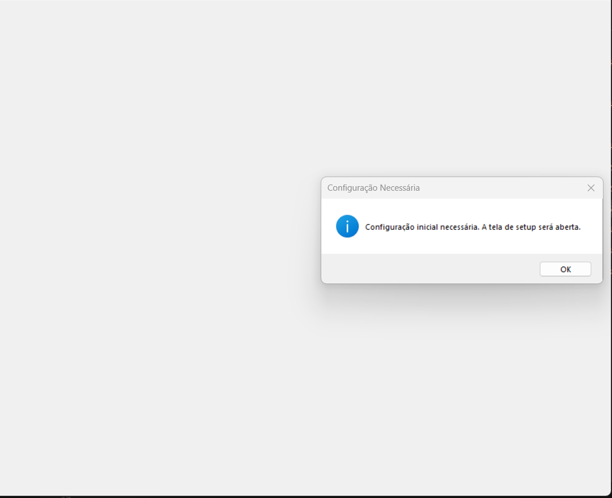

**Configuração da Licença:**
Após a primeira execução, o sistema solicitará os dados de licença. Adicione as informações que você obterá no próximo passo:

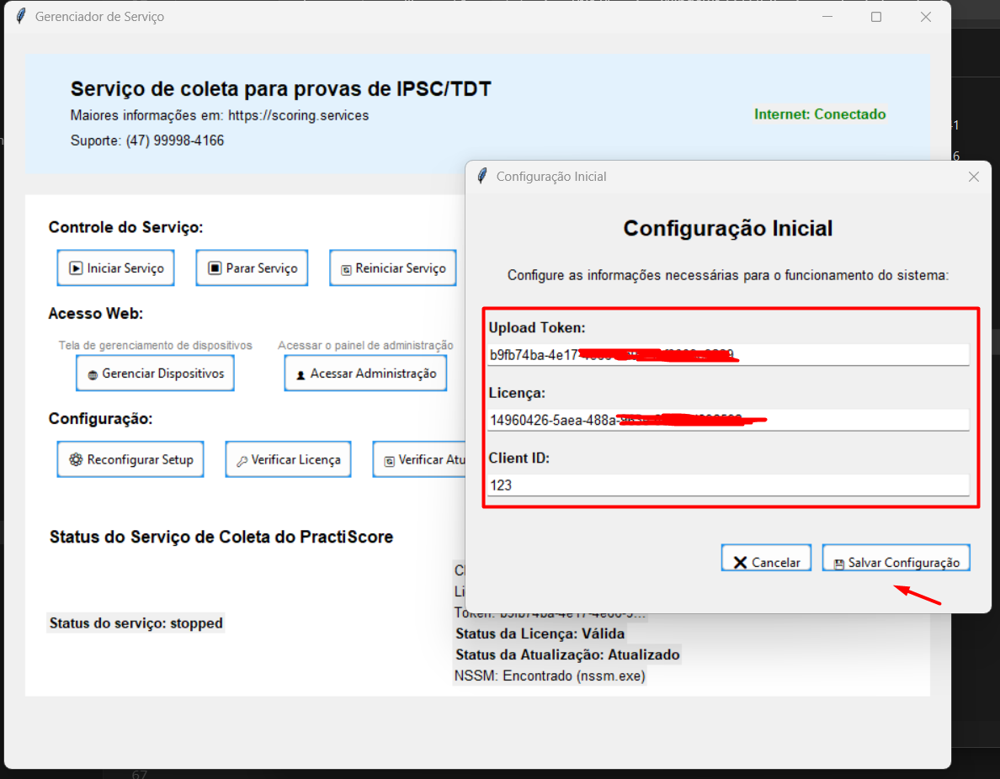

#### 2.2 Obter Credenciais de Licença
**O que fazer:** Obter as credenciais necessárias para ativar o sistema
O sistema irá solicitar a configuração da licença. Para obter as credenciais necessárias:

**Passo 1:** Acesse o portal de licenças
- Abra seu navegador e vá para: https://login.scoring.services
- Faça login com o seu usuário e senha

**Passo 2:** Navegar até o perfil
- Após fazer login, clique em **Perfil** no menu superior

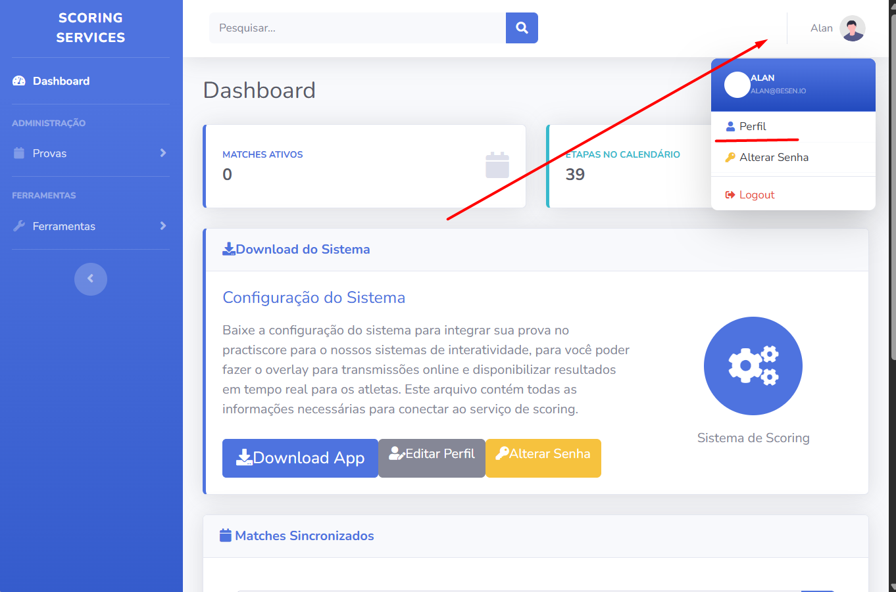

**Passo 3:** Copiar as credenciais
- Na seção de perfil, você encontrará três informações importantes:
  - **Licença:** Código de ativação do sistema
  - **Token:** Chave de autenticação
  - **User ID:** Identificador do usuário
- Copie essas três informações (você precisará delas na próxima etapa)

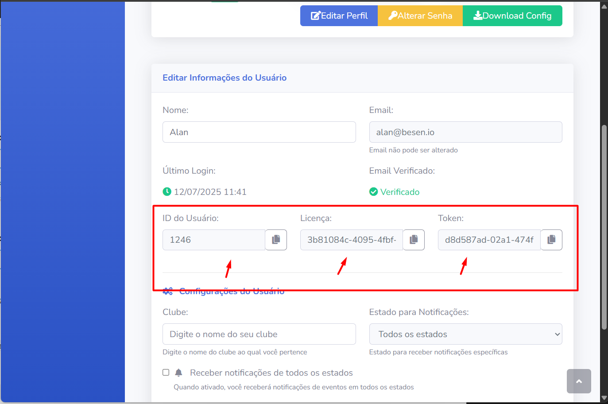

**Dica:** Mantenha essas informações em local seguro, pois serão necessárias para futuras configurações

### 3. Instalação e Inicialização do Serviço

#### 3.1 Instalar o Serviço
**O que fazer:** Instalar o serviço do sistema no Windows
Após configurar a licença, você terá a tela inicial onde instalará o serviço necessário:

- Clique no botão **"Instalar Serviço"** ou similar
- **O que acontece:** O sistema criará um serviço do Windows que rodará automaticamente
- **Permissões:** O Windows pode solicitar permissões de administrador - aceite

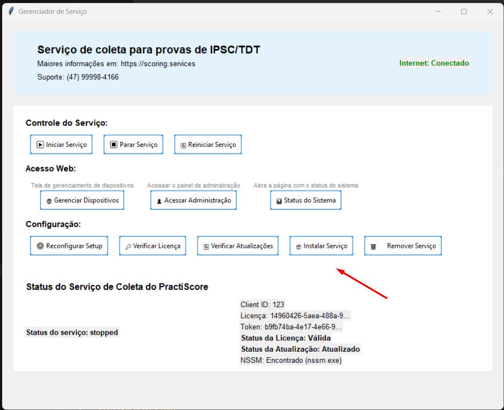

#### 3.2 Iniciar o Serviço
**O que fazer:** Ativar o serviço para começar a funcionar
Após instalar, você pode iniciar o serviço:

- Clique no botão **"Iniciar Serviço"** ou similar
- **Status:** O sistema mostrará que o serviço está "Rodando" ou "Ativo"
- **Verificação:** Uma luz verde ou indicador similar confirmará que está funcionando

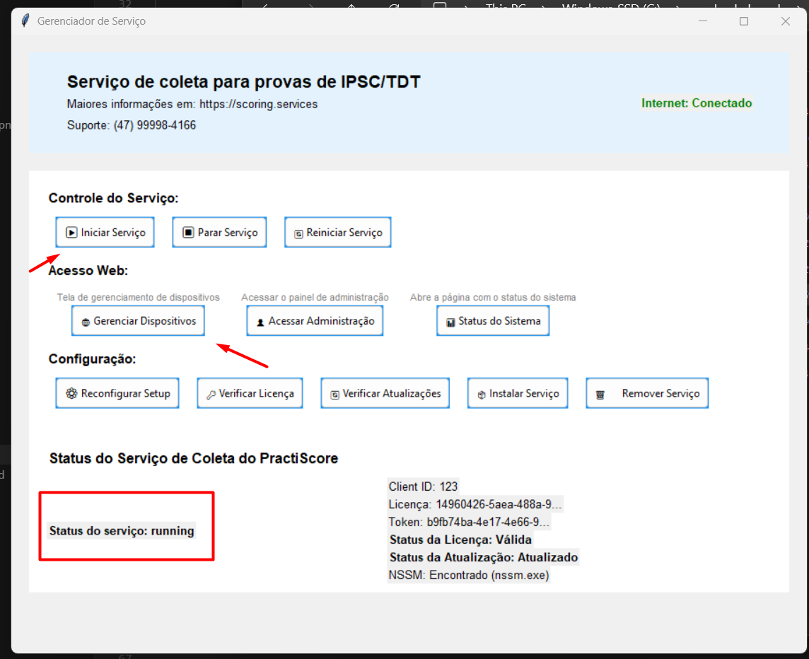

### 4. Configuração dos Tablets

#### 4.1 Acessar a Interface de Dispositivos
**O que fazer:** Abrir a interface web para configurar os tablets
Para configurar os tablets, você tem duas opções:

**Opção 1 - Via URL direta:**
- Abra seu navegador e acesse: `http://<IP>:5001/devices`
- **Substitua <IP>** pelo IP do seu computador (exemplo: `http://192.168.1.100:5001/devices`)

**Opção 2 - Via botão na interface:**
- Clique no botão **"Acessar"** conforme imagem anterior após iniciar o serviço

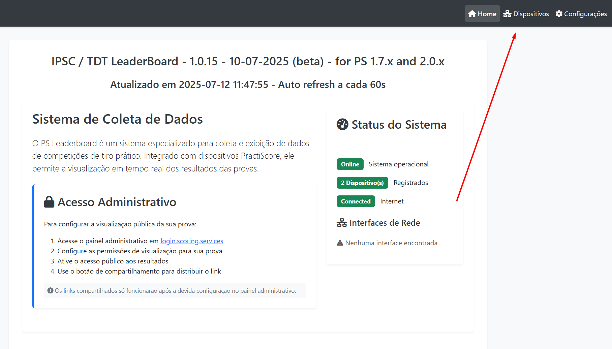

#### 4.2 Escanear e Adicionar Tablets
**O que fazer:** Encontrar e conectar os tablets na rede
Você pode fazer o scan e adicionar os tablets:

- Clique no botão **"Iniciar Scan"** ou similar
- **O que acontece:** O sistema procurará por tablets com PractiScore na rede local
- **Tempo:** O scan pode levar alguns segundos dependendo do tamanho da rede

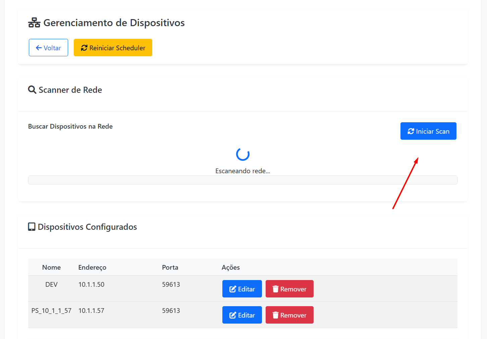

**Adicionar os dispositivos encontrados:**
- Na lista de dispositivos encontrados, selecione os tablets que deseja conectar
- Clique em **"Adicionar"** ou **"Conectar"** para cada tablet
- **Confirmação:** O sistema mostrará uma mensagem de sucesso para cada tablet adicionado

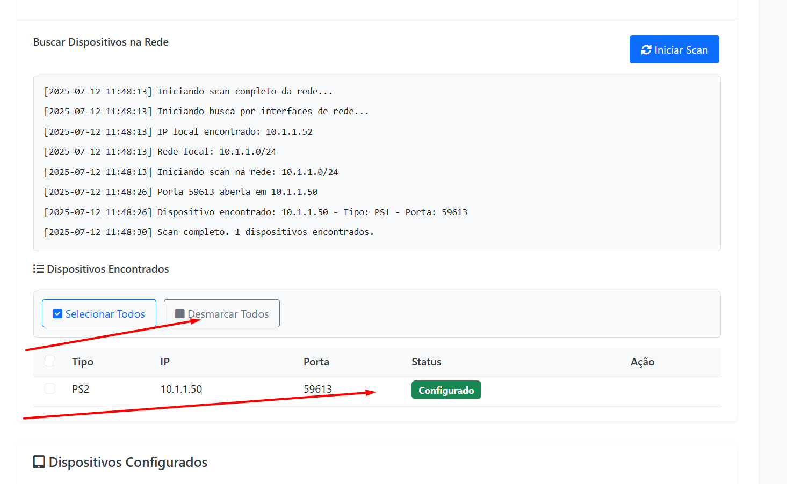

#### 4.3 Reiniciar o Serviço
**O que fazer:** Aplicar as mudanças e reiniciar o sistema
Após adicionar os dispositivos, é necessário reiniciar o serviço:

- Clique no botão **"Reiniciar Serviço"** ou similar
- **Aguarde:** O sistema parará e iniciará novamente automaticamente
- **Confirmação:** Volte para a tela principal quando o serviço estiver rodando novamente

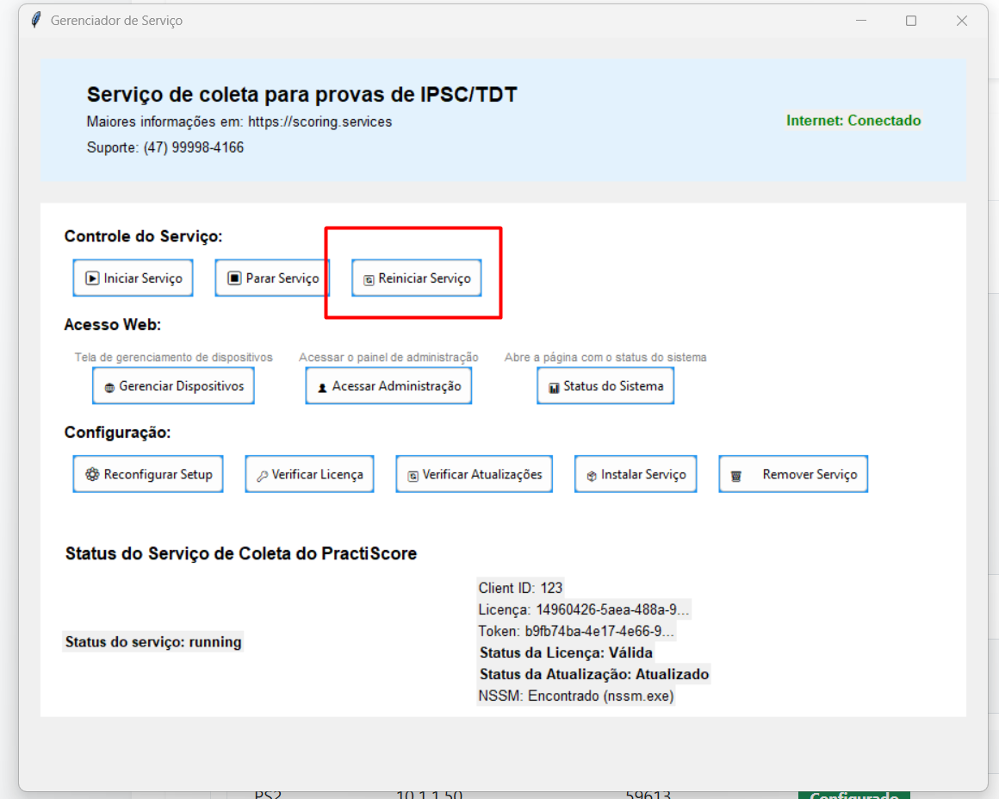

#### 4.4 Verificar Dispositivos Conectados
**O que fazer:** Confirmar que os tablets estão conectados e funcionando
Após isso, os dados começarão a aparecer automaticamente no painel de administração:

- **Pré-requisito:** Certifique-se de que o PractiScore está aberto no tablet
- **Coleta de dados:** O sistema começará a receber informações da prova automaticamente
- **Tempo:** Pode levar alguns segundos para os primeiros dados aparecerem

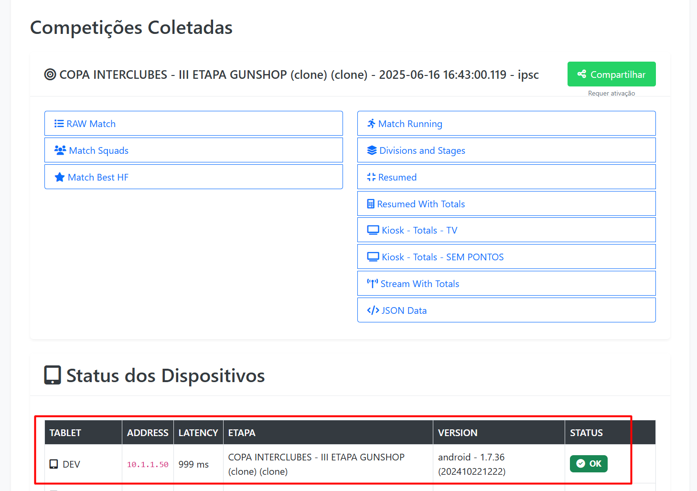

### 5. Configuração Final

#### 5.1 Acesso ao Painel de Administração
**O que fazer:** Acessar o painel principal para visualizar a prova
No painel de admin, você já irá ver a prova após 60 segundos:

- **URL do painel de admin global:** https://login.scoring.services
- **Primeira visualização:** A prova aparecerá automaticamente após 60 segundos
- **Atualizações:** Os dados se atualizam em tempo real conforme os atletas completam as etapas

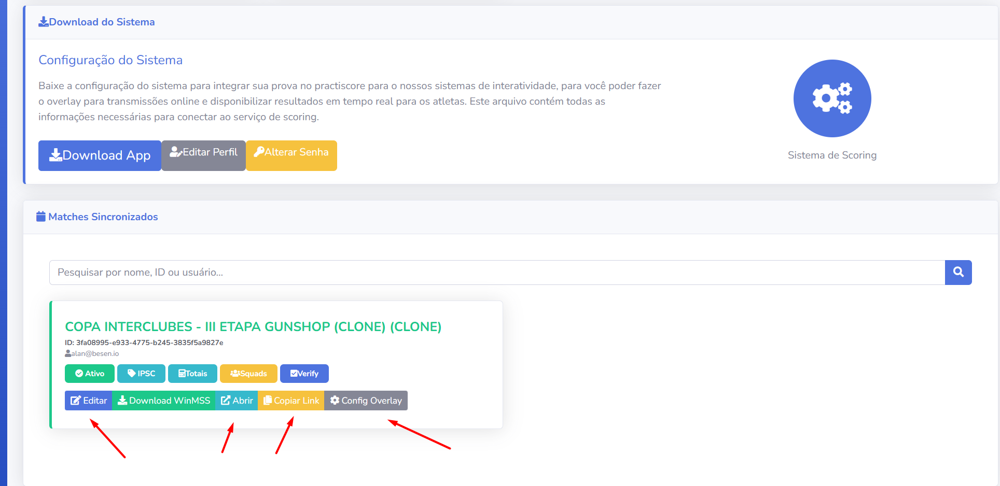

#### 5.2 Funcionalidades Disponíveis
**O que você pode fazer:** Explorar as funcionalidades do sistema
Após a configuração completa, você terá acesso a:

**Para Atletas:**
- **Link público:** Compartilhe o link com os atletas para que acompanhem suas posições
- **Atualizações em tempo real:** Os atletas veem suas posições atualizadas instantaneamente
- **Acesso móvel:** Os atletas podem acessar via https://m.scoring.services

**Para Transmissões:**
- **Overlay para OBS Studio:** Configure o overlay para transmissões ao vivo
- **App Prism:** Use o app Android ou iPhone para lives e transmissões
- **Personalização:** Configure cores, logos e informações da sua organização

**Para Administradores:**
- **Painel de controle:** Monitore todos os dispositivos conectados
- **Configurações avançadas:** Ajuste parâmetros específicos da prova
- **Relatórios:** Gere relatórios detalhados da competição

## Próximos Passos

Após a instalação completa, recomendamos:

1. **Testar o sistema** com uma prova pequena antes de usar em competições importantes
2. **Configurar o overlay** para suas transmissões
3. **Treinar os árbitros** no uso dos tablets
4. **Compartilhar a prova com os atletas** usando o link gerado no sistema ou acessando https://m.scoring.services

## Suporte

Se encontrar problemas durante a instalação:
- Verifique se todos os requisitos do sistema estão atendidos
- Certifique-se de que o firewall não está bloqueando as conexões
- Confirme que todos os dispositivos estão na mesma rede
- Entre em contato com o suporte técnico se necessário
